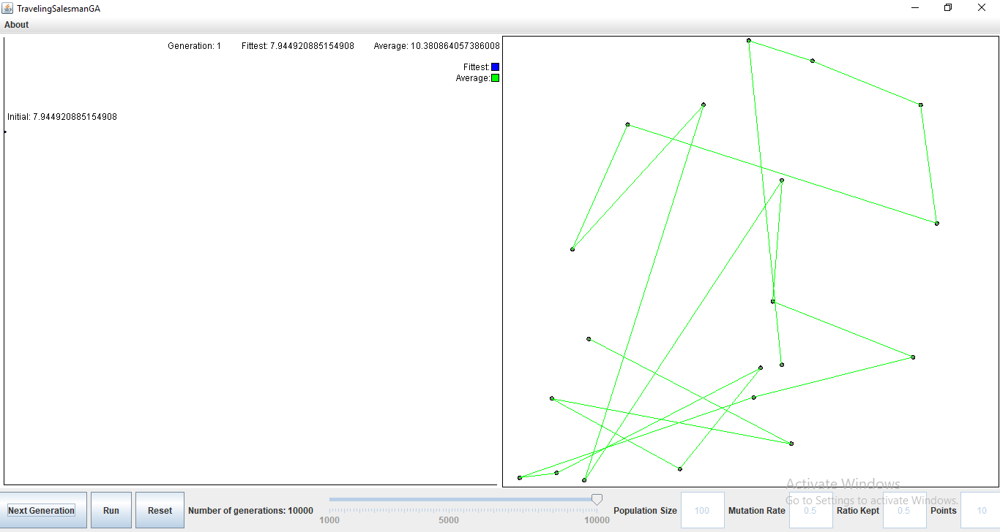

# Traveling Salesman in GA

While reading a book on Genetic Algorithms (added to repo), I decided to create my own Traveling Salesman implementation using GAs with an interactive interface.

---
# Theory

First, what is that Traveling Salesman Problem? 
Quoting directly from wikipedia:
> The travelling salesman problem (also called the travelling salesperson problem[1] or TSP) asks the following question: "Given a list of cities and the distances between each pair of cities, what is the shortest possible route that visits each city and returns to the origin city?"

So let's assume we have a picture that looks like 

where the dimensions of the square are 1units x 1units and there are N cities represented by dots. A salesman must choose a city to start from and visit every single city. The path the salesman takes are the lines connecting the dots. What is the most efficient path the salesman can take while minimizing the total distance traveled?

This problem is NP-hard and takes alot of computation using greedy algorithms for example brute forcing take a time of O(N!) since this is a combinatorial optimization problem.

For further reading and other approaches, here's the wiki link. I suggest reading up on it since it's very interesting, and there are really smart approaches to solve it.

---

# Approach

I first create a population of P individuals. Since we have N points, each individual will have N genes. So to simplify, for every individual, the individual has a specific sequence of traversing all cities. For example, if there were 4 cities, and an individual's genes looked like [ 1 3 2 4 ], then the individual goes through cities 1 -> 3 -> 2 -> 4.

First we sum the distances it travels between points. We want to minimize the score therefore, an individual's score is the inverse squared of the total sum. The inverse is to give shorter distance a higher distance. The square is to separate close distances by giving them a higher score difference.

We then sort the P individuals by score in descending order. We remove the low scoring individuals and keep the upper [ratio kept]%. Then, we keep the highest scoring individual for the next generation (This is known as elitism). We then crossover individuals by selecting them randomly using Roulette Selection, which gives higher scoring individuals a better chance to be selected for crossover.

    public static int rankingSelection(Population pop, int offset) {
		int random = (int) (Math.random() * (offset) * (offset + 1) / 2);
		int total = offset;
		int index = -1;
		for (int i = 1; i <= offset; i++) {
			if (random < total) {
				index = i;
				break;
			} else
				total += (offset - i);
		}
		return index - 1;
	}

After two Individuals are selected for crossover, their genes are mixed using Cyclic Crossover which ensures that the Child Individual has every city only once in his genes.

    public static Pair<Individual> cycleCrossover(Individual parent1, Individual parent2) {
		int[] child1 = parent1.getGenes().clone();
		int[] child2 = parent2.getGenes().clone();
		int location = (int) (Math.random() * child2.length);

        int initial = child1[location];
		int left = child2[location];
		while (left != initial) {
			left = child2[location];
			child2[location] = child1[location];
			child1[location] = left;
			for (int i = 0; i < child1.length; i++)
				if (child1[i] == left && location != i) {
					location = i;
					break;
				}
		}
		return new Pair<Individual>(new Individual(child1), new Individual(child2));
	}
Finally, a random mutation occurs at a random rate. The mutation swaps two random cities in the gene sequence.

    public static void mutate(Individual ind) {
		int loc = (int)(Math.random()*Individual.geneLength);
		int loc2;
		do {
			loc2 = (int)(Math.random()*Individual.geneLength);
		}while(loc2 == loc);
		int temp = ind.getGene(loc);
		ind.setGene(ind.getGene(loc2), loc);
		ind.setGene(temp, loc2);
	}
---
# Demonstration

First the number of cities (points), the population size, the mutation rate, the ration kept, and the number of generations is set. Press initialize as such:

The Next Generation could be pressed to advance the population one generation at a time and see how it changes over time. as such:

Finally the Run button could be pressed to fully go through all generations and reach the final results after the set number of generations have passed.

